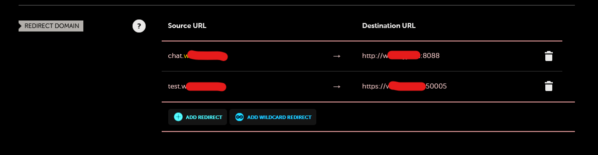

简单来说，我在内网`192.168.1.n:1234`上启动了一个服务，我的家宽不能使用443/80端口，我已经设置好DDNS，我想在外网直接通过不带端口号的url(e.g. aa.bb.com/)来访问，那我该怎么做呢？
这时候你还是需要一个端口，虽然在使用的时候不会被感知，我们假定这个端口是`8088`。

首先要保证你的DDNS服务商提供了redirect_host服务，那我用的namecheap举例如下图：

--------
Source Url | Destination Url
--------
chat.bb.com| http://bb.com:8088:
--------

nginx的`conf.d`文件夹新建一个配置文件，`example.conf`，内容如下
```nginx
server {
    listen 8088 default_server ssl http2;
    access_log /var/log/gpt_t.log;
    ssl_certificate /etc/nginx/conf.d/xxx.crt;
    ssl_certificate_key /etc/nginx/conf.d/xxx.key;
    error_page 497 301 =307 https://$host:$server_port$request_uri;
    # Proxy the requests to the backend
    location / {
        proxy_pass http://192.168.1.n:1234;
        proxy_set_header Host $host;
        proxy_set_header X-Real-IP $remote_addr;
        proxy_set_header X-Forwarded-For $proxy_add_x_forwarded_for;
        proxy_set_header X-Forwarded-Proto $scheme;
    }
}
```
这个配置将监听`8088`端口，然后`proxy_pass`到`3002`端口，并且建立ssl连接。   
`default_server` 用来保证不挑server name，给他独享端口，当然你也可以不必这么做。   
`error_page 497 301 =307` 是保证http变成https的关键。

这时候就可以通过 `chat.bb.com` 来访问 `192.168.1.n:1234`的服务了。