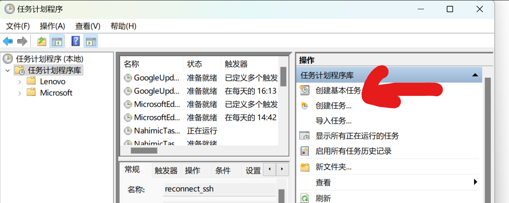
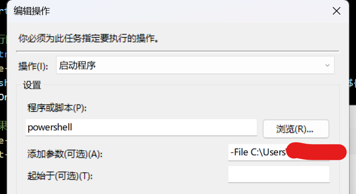

## 目的
在家办公，又不想把电脑背回家，最好的选择是使用VPN连到公司网络，然后使用个人机器通过远程桌面连接到公司开发机器。

然而如果公司没有提供VPN服务，并且无法完成防火墙的端口映射。那只好通过SSH隧道的方式进行内网穿透，来完成远程桌面的操作了。

**注意：这是一项高风险操作，可能会违背公司的网络管理规范，如果你在大厂有专业的网关和IT，切记不可参考本文的操作。**

## 网络条件
```
┌─────────────┐        ┌──────────┐                             
│   HomeCmp   │        │ HomeRtr  │                             
│ 192.168.x.x ├────────┤222.x.x.x ├─────────────────┐           
└─────────────┘        │public IP │                 │           
                        └──────────┘                 ▼           
                                              xnxxxxxxxxxxx     
                                              xxxxxxxxxxxxx     
                                              xx Internet x     
                                              xxxxxxxxxxxxx     
                                              xxxxxxxxxxxxx     
┌─────────────┐       ┌────────────┐                ▲           
│OfficeCmp    │       │ OfficeRtr  │                │           
│192.x.x.x    ├───────┤whatever IP ├────────────────┘           
│whatever IP  │       └────────────┘                            
└─────────────┘                                                 
```
要求：
* 家里有公网IP，且路由器可以设置端口转发。
* 公司的机器能上网，公司路由器不封锁SSH连接

## 操作步骤：
主要包含 建立隧道，连结保持，开机自启

## 建立隧道阶段
### 1. 在家里的服务器上开启SSH server，并设置以下参数
```
AllowAgentForwardingyes
AllowTcpForwardingyes
GatewayPortsyes
ClientAIiveIntervaI120
ClientAIiveCountMax10
```
找台机器测试一下是否可以连接上服务器的SSH端口 `192.168.x.x:22`，确保没有ufw防火墙封锁22端口。\
强烈推荐设置仅允许证书验证，多次失败封IP等一系列安全配置。此处略过。

### 2. 家里路由器上设置端口映射，把服务器的SSH服务转发到外网\
这一段比较简单，路由器的防火墙设置就好，举例从内网`192.168.x.x:22`转发到`49157`。\
然后找台电脑连手机热点，确保可以通过访问`222.x.x.x:49157`连接到内网的`192.168.x.x:22`。

### 3. 在公司的个人电脑上，建立隧道
首先确保电脑的SSH客户端可用。用以下命令建立SSH隧道。
```powershell
ssh -R 13389:localhost:3389 user@222.x.x.x -p 49157
```
这时会连接到家庭服务器的SSH端口，并打开bash窗口。\
执行`netstat -lntp`命令，确保`13389`端口打开处在listen状态
```bash
sh@sh-vm:~$ netstat -lntp
(Not all processes could be identified, non-owned process info
 will not be shown, you would have to be root to see it all.)
Active Internet connections (only servers)
Proto Recv-Q Send-Q Local Address           Foreign Address         State       PID/Program name
tcp        0      0    0.0.0.0:13389         0.0.0.0:*               LISTEN      -
```

### 4. 回家在家里的电脑上，连接公司电脑

如下图\


正常登录即可

## 保持长连接配置：
### 5. 写一个powershell脚本
```shell
$sshPath = "ssh" # 确保ssh可执行文件在你的环境变量PATH中，或提供完整路径
$sshKeyPath = "path_to\id_rsa"
$sshUser = "root"
$sshHost = "222.x.x.x"
$sshPort = 49157
$remoteForwardPort = 13389
$localHost = "localhost"
$localPort = 3389

# 持续运行的循环，以便在断开连接时重新连接
while ($true) {
    Write-Output "Trying to establish SSH tunnel..."
    & $sshPath -i $sshKeyPath -R "${remoteForwardPort}:${localHost}:${localPort}" $sshUser@$sshHost -p $sshPort -o ExitOnForwardFailure=yes -o ServerAliveInterval=60
    
    # 如果SSH命令退出，假设连接已经丢失，等待一段时间后重试连接
    Write-Output "The SSH tunnel has been disconnected. Trying to reconnect in 5 seconds..."
    Start-Sleep -Seconds 5
}
```
保存并运行此脚本，就可以实现ssh隧道的长连接

### 6. 开机启动配置
有时候Windows会自己重启，或者断电重启，重启后如果脚本没有被运行，那也是无法实现ssh隧道。\
一个不成熟的解决办法是使用`WinSW-x64.exe`创建一个服务，但是这个服务要依赖于session的创建，即必须要用用户登录后才能运行服务。

另一个解决办法是创建定时任务，此任务的触发时机是开机启动时，就可以解决未登录状态下的SSH长连接的问题。
* 打开任务计划程序，选择创建基本任务\

* 如图配置\
\
\
下图添加参数处，写上`-File path_to_powershell_script`\

* 重启电脑，测试远程桌面，理论上就可以输入账户直接登录了